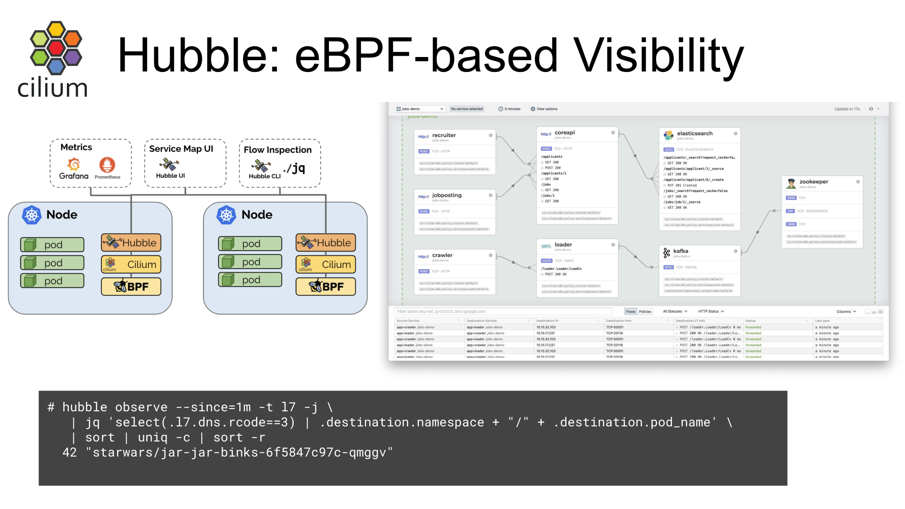

# Hubble

Hubble is a fully distributed networking observability platform. It is built on top of Cilium and eBPF to enable deep visibility into the communication and behavior of services, as well as the networking infrastructure in a completely transparent manner.

By building on top of Cilium, Hubble can leverage eBPF for observability. By relying on eBPF, Hubble provides programmable observability, allowing for a dynamic approach that minimizes overhead while providing deep and detailed visibility. Hubble was created and specifically designed to make best use of these new eBPF powers.

## Service dependencies & communication map
What services are communicating with each other? How frequently? What does the service dependency graph look like?
What HTTP calls are being made? What Kafka topics does a service consume from or produce to?

## Network monitoring & alerting
Is any network communication failing? Why is communication failing? Is it DNS? Is it an application or network problem? Is the communication broken on layer 4 (TCP) or layer 7 (HTTP)?
Which services have experienced a DNS resolution problem in the last 5 minutes? Which services have experienced an interrupted TCP connection recently or have seen connections timing out? What is the rate of unanswered TCP SYN requests?

## Application monitoring
What is the rate of 5xx or 4xx HTTP response codes for a particular service or across all clusters?
What is the 95th and 99th percentile latency between HTTP requests and responses in my cluster? Which services are performing the worst? What is the latency between services?

## Security observability
Which services had connections blocked due to network policy? What services have been accessed from outside the cluster? Which services have resolved a particular DNS name?

```shell
hubble observe --since=1m -t 17 -j \
  | jq 'select(.17.dns.rcode == 3) | .destination.namespace + "/" + .destination.pod_name' \
  | sort | uniq -c | sort -r
  42 "starwars/jar-jar-binks-6f5847c97c-qmggv"
```



## Operational components

### Hubble Server
- Runs on each Kubernetes node as part of Cilium agent operations.
- Implements the gRPC observer service, which provides access to network flows on a node.
- Implements the gRPC peer service used by Hubble Relay to discover peer Hubble servers.

### Hubble Peer Kubernetes
Service Used by Hubble Relay to discover available Hubble servers in the cluster.

### Hubble Relay Kubernetes Deployment
* Communicates with Cluster-wide Hubble Peer service to discover Hubble servers in the cluster.
* Keeps persistent connections with Hubble server gRPC API.
* Exposes API for cluster-wide observability.

### Hubble Relay Kubernetes Service
* Used by the Hubble IJI service.
* Can be exposed for use by Hubble CLI tool.

## Network Flows

Network flows are a key concept in Hubble’s value. Flows are similar to a packet capture that you would get from a tool like tcpdump, except instead of focusing on the packet contents, flows are designed to help you better understand how packets flow through your Cilium-managed Kubernetes cluster.

Flows include contextual information that helps you figure out where in the cluster a network packet is coming from, where it’s going, and whether it was dropped or forwarded; without having to rely on knowing the source and destination IP addresses of the packet. Since Kubernetes pod IP addresses are ephemeral resources, they aren’t reliable enough to filter on. Simply capturing packets from the same IP address for several minutes, as you would do with a VM running in a data center, may not help diagnose Kubernetes pod networking issues and it certainly won’t help you construct trendable metrics for any application. Flows provide contextual metadata that is more durable inside of a Kubernetes cluster that you can filter on.

Moreover, you can expose the context made available by flows as labels in Prometheus metrics. Flows make it possible to have metrics in your networking dashboard labeled in a way that corresponds to your application performance, even as they scale up or down. The metric labels derived from flows are another great benefit of Cilium’s identity model that just makes sense in a Cloud Native world.

Here’s an abbreviated example of a flow we’ve captured using the Hubble CLI tool so you can see what contextual metadata is available in a flow. This flow is from the Death Star service endpoint node, created when the TIE fighter pod was denied a PUT request made in the last chapter’s lab. The flow is captured using the Hubble CLI tool running on the same Kubernetes node as a Death Star backend endpoint.

```json
{
      "time": "2023-03-23T22:35:16.365272245Z",
      "verdict": "DROPPED",
      "Type": "L7",
      "node_name": "kind-kind/kind-worker",
      "event_type": {
           "type": 129
      },
      "traffic_direction": "INGRESS",
      "is_reply": false,
      "Summary": "HTTP/1.1 PUT http:‌//deathstar.default.svc.cluster.local/v1/exhaust-port"
      "IP": {
"source": "10.244.2.73",
           "destination": "10.244.2.157",
           "ipVersion": "IPv4"
      },
      "source": {
           "ID": 62,
           "identity": 63675,
           "namespace": "default",
           "labels": [...],
           "pod_name": "tiefighter"
      },
      "destination": {
                 "ID": 601,
                 "identity": 25788,
                 "namespace": "default",
                 "labels": [...],
                 "pod_name": "deathstar-54bb8475cc-d8ww7",
                 "workloads": [...]
      },
      "l4": {
           "TCP": {
                "source_port": 45676,
                "destination_port": 80
             }
      },
      "l7": {
           "type": "REQUEST",
           "http": {
                "method": "PUT",
                "Url": "http:‌//deathstar.default.svc.cluster.local/v1/exhaust-port",
                ...
           }
      }
}
```

There’s a lot of contextual information packed into a flow. Looking just at the top of the JSON object, from the Verdict and Type information we can see this flow resulted in a packet drop, associated with Layer 7 network policy logic. If we inspect the flow of the same PUT request made by an X-wing pod, we would see the same DROPPED verdict, but the TYPE would be L3_L4, because the X-wing connection to the exhaust-port was denied due to Layer 3-4 policy, not the Layer 7 policy we crafted in the previous lab. Skimming further through the JSON object, there’s a lot more information in the flows that can help diagnose networking problems quickly.

```shell

cilium hubble ui

```


## Craft DNS Deny Policy
To narrowly target the X-wing access to the DNS service, we can craft an explicit EgressDeny policy that applies only to the X-wing pods.

Save this CiliumNetworkPolicy definition to a file called xwing-dns-deny-policy.yaml:

```yaml
apiVersion: "cilium.io/v2"
kind: CiliumNetworkPolicy
metadata:
  name: "xwing-dns-deny"
spec:
  endpointSelector:
    matchLabels:
      class: xwing
  egressDeny:
  - toEndpoints:
    - matchLabels:
        namespace: kube-system
        k8s-app: kube-dns
```

The policy applies to all pods labeled "class=xwing" and will restrict packet egress to any endpoint labeled as "k8s-app=kube-dns" in the kube-system namespace.

We can apply this YAML manifest to our cluster:

```shell
kubectl apply -f xwing-dns-deny-policy.yaml
```
Now we see that if we attempt X-wing landing requests as before, we get a different error message:

```shell
kubectl exec xwing -- curl --connect-timeout 2 -s -XPOST deathstar.default.svc.cluster.local/v1/request-landing
command terminated with exit code 6
```

And if we look at the flows between the X-wing pod and the DNS service, we now see packets are being dropped:

```shell
hubble observe --label="class=xwing" --to-namespace "kube-system" --last 1
Nov 8 13:08:00.359: default/xwing:39801 (ID:50037) <> kube-system/coredns-6f6b679f8f-7kvwn:53 (ID:42420) Policy denied DROPPED (UDP)
```

Because this was a narrowly targeted EgressDeny policy, the TIE fighters are still allowed to send landing requests.

```shell
kubectl exec tiefighter -- curl --connect-timeout 2 -s -XPOST deathstar.default.svc.cluster.local/v1/request-landing
Ship landed

hubble observe --label="class=tiefighter" --to-namespace "kube-system" --last 1
Nov 8 13:09:34.603: default/tiefighter:39489 (ID:21450) -> kube-system/coredns-6f6b679f8f-7kvwn:53 (ID:42420) to-endpoint FORWARDED (UDP)
```

Excellent! Lord Vader will be pleased.

Note: You could achieve a similar result by changing the policy from an EgressDeny policy applied to the X-wing pods to an IngressDeny policy applied to the pods acting as kube-dns service endpoints. There’s always some flexibility in how you approach policy when both the source and destination are Cilium-managed endpoints.