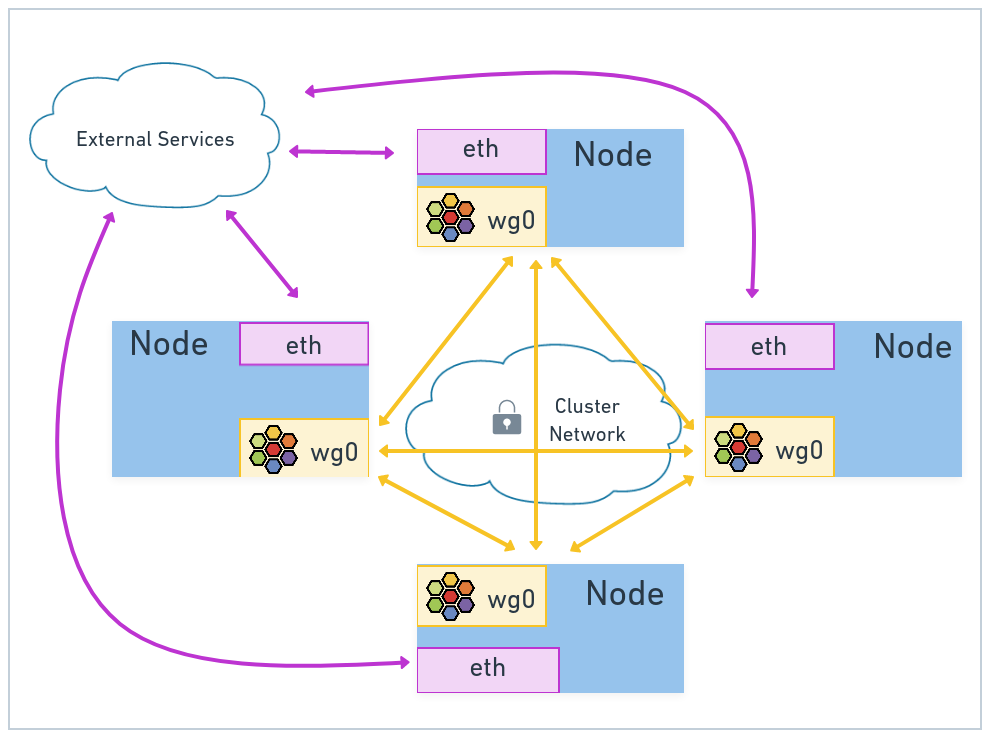

# Transparent Encryption

Cilium supports both IPsec and WireGuard in transparently encrypting traffic between nodes. In this chapter, we’ll learn how to configure Cilium to use transparent encryption to enhance network security. We’ll briefly discuss why you would want to enable this feature and provide an overview of WireGuard and IPsec. We’ll end with a hands-on lab enabling WireGuard in your cluster and ensuring it’s working as expected.

By the end of this chapter you should be able to:

* Discuss the benefits of encrypted communication between nodes inside your Kubernetes cluster.
* Enable transparent encryption in your Cilium-managed cluster.
* Verify WireGuard is being used for internal cluster traffic.




WireGuard and IPsec are both protocols that provide in-kernel transparent traffic encryption.

WWireGuard is a simple-to-use, lightweight virtual Private Network (VPN) solution built into the Linux kernel. WireGuard is a peer-based VPN solution. A VPN connection is made between peers simply by exchanging public keys (similar to exchanging SSH keys).

## Benefits of Replacing Kube-Proxy
CNI plugins, like Cilium, aren’t the only place where the container’s networking configuration is modified. The kube-proxy daemonset, which implements part of the Kubernetes services model, also interacts with the Linux container networking stack. kube-proxy adjusts the iptables ruleset controlling load balancing of Kubernetes services to pods acting as service endpoints using forwarding rules for virtual IP addresses. Kube-proxy installs multiple iptables rules for each backend a service is serving. For each service added to Kubernetes, the list of iptables rules to be traversed grows exponentially! This can have serious performance impacts at large production scales.

With eBPF, it's possible to replace kube-proxy entirely with Cilium so that eBPF programs perform the same service endpoint load balancing for increased scalability. Once you've replaced kube-proxy with Cilium, you can significantly reduce the churn in iptables rules, save on resource overhead, and speed up your cluster scaling operations.\


## Cluster mesh

There are several real-world situations where a multiple Kubernetes cluster topology is used at production scale. Some common use cases are described below.

https://cilium.io/blog/2019/03/12/clustermesh/

### Use Cases for Multiple Clusters

High availability
This use case includes operating Kubernetes clusters in multiple regions or availability zones and running replicas of the same services in each cluster. During outages, requests can fail over to other clusters. The failure scenario covered in this use case is not primarily the complete unavailability of the entire region or failure domain. A more likely scenario is the temporary unavailability of resources or misconfiguration in one cluster leading to the inability to run or scale particular services in a cluster.

Shared Services
The initial trend of Kubernetes-based platforms was to build large, multi-tenant Kubernetes clusters. It is becoming more common to build individual clusters per tenant or to build clusters for different categories of services, e.g. different levels of security sensitivity. However, some services such as secrets management, logging, monitoring, or DNS are often still shared between all clusters. This avoids operational overhead in maintaining these services in each tenant cluster. The primary motivation of this model is isolation between the tenant clusters. To support that goal, tenant clusters are connected to the shared services clusters but not to other tenant clusters.

Splitting Stateful Services from Stateless Services
The operational complexity of running stateful or stateless services is very different. Stateless services are simple to scale, migrate, and upgrade. Running a cluster entirely with stateless services keeps the cluster nimble and agile. Stateful services, in contrast, can introduce a potentially complex dependency chain. Migrating stateful services across infrastructure providers typically involves the migration of storage. Running individual clusters for stateless and stateful workloads allows isolating the dependency complexity to a smaller number of clusters and keeps the stateless clusters dependency free.

### Benefits of Cluster Mesh

The unified network established by the Cilium Cluster Mesh provides:

* Pod IP routing across multiple Kubernetes clusters at native performance via tunneling or direct-routing without requiring any gateways or proxies.
* Transparent service discovery of globally available Kubernetes services using coredns/kube-dns.
* Network policy enforcement spanning multiple clusters.
* Policies can be specified as Kubernetes NetworkPolicy or CiliumNetworkPolicy resources.
* Transparent encryption for all communication between nodes anywhere in all the clusters.

### Requirements
Before you can enable the Cluster Mesh feature, you must make sure certain requirements are met:

* All Kubernetes worker nodes must be assigned a unique IP address, and all worker nodes must have IP connectivity between each other.
* All clusters must be assigned unique PodCIDR ranges to prevent pod IP addresses from overlapping across the mesh.
* The network between clusters must allow inter-cluster communication so Cilium agents can access all Cluster Mesh API Servers in the mesh. Public cloud Kubernetes services typically use virtual private network peering and/or network security group configuration to ensure node-to-node communication between clusters. The exact firewalling requirements depend on whether Cilium is configured to run in direct-routing or tunneling mode.

### Global Services
Establishing service load-balancing between clusters is achieved by defining a Kubernetes service with an identical name and namespace in each cluster and adding the annotation service.cilium.io/global: "true" to declare it as a global service. Cilium agents will watch for this annotation and if it's set to true, will automatically perform load-balancing to the corresponding service endpoint pods located across clusters.

You can control this global load-balancing further by setting the annotation service.cilium.io/shared: to true/false in the service definition in different clusters, to explicitly include or exclude a particular cluster’s service from being included in the multi-cluster load-balancing. By default, setting service.cilium.io/global: "true" implies service.cilium.io/shared: "true" if it's not explicitly set.

In some cases, load-balancing across multiple clusters might not be ideal. The annotation service.cilium.io/affinity: "local|remote|none" can be used to specify the preferred endpoint destination.

For example, when the value of annotation service.cilium.io/affinity is set to local, the global service will be load-balanced across healthy local backends, and remote endpoints will only be used if and only if all of the local backends are not available or unhealthy. Using the local affinity annotation, you effectively create a global service fail-over configuration that prefers healthy cluster-local service endpoints until none are available, and will then load-balance to service endpoints in remote clusters if that is not possible.


Network Policy
Once the Cluster Mesh is enabled, it's possible to write a network policy to better secure cross-cluster pod-to-pod communication. By matching labels corresponding to specific cluster names, it's possible to craft network policy in a granular fashion that works across all connected clusters. For example, assuming you have rebel-base shared global service configured and want to ensure X-wings in cluster1 are allowed to communicate with the rebel-base in cluster2, you could deploy this policy:

```yaml
apiVersion: "cilium.io/v2"
kind: CiliumNetworkPolicy
metadata:
  name: "allow-cross-cluster"
spec:
  description: "Allow x-wing in cluster1 to contact rebel-base in cluster2"
  endpointSelector:
    matchLabels:
      name: x-wing
      io.cilium.k8s.policy.cluster: cluster1
  egress:
  - toEndpoints:
    - matchLabels:
        name: rebel-base
        io.cilium.k8s.policy.cluster: cluster2
```